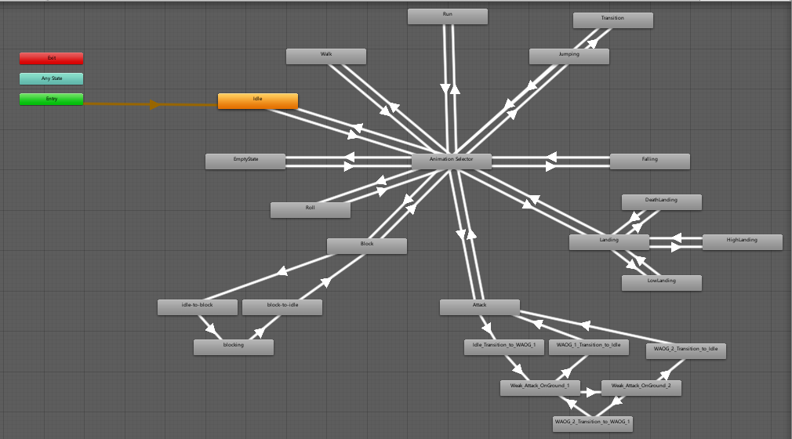
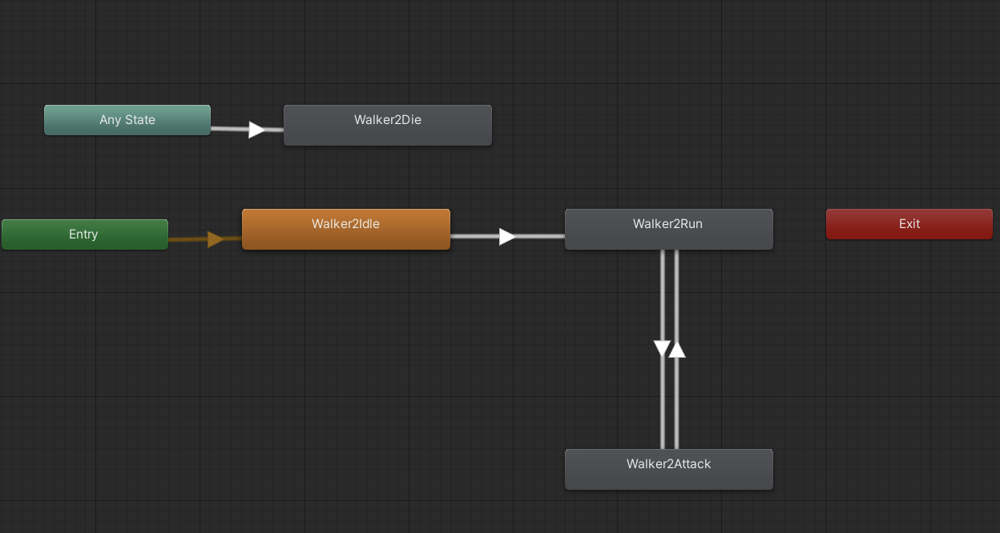
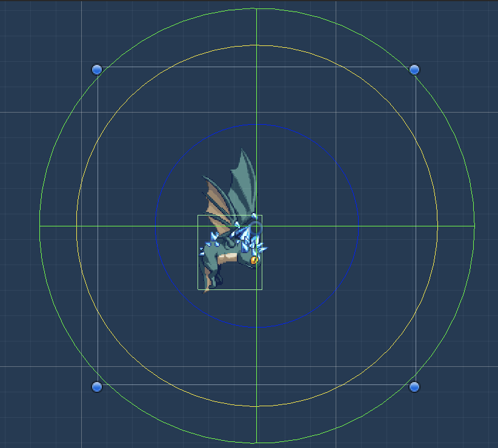
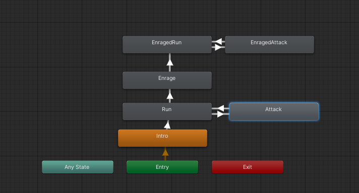

1852141 李德涛

1852138 闫沐西

1854063 姜昱九

1851521 沈天宇

1853534 关敬徽

Github：[https://github.com/Ultrasty/game-power](https://github.com/Ultrasty/game-power?fileGuid=whYWYrxrttT3Rpxx)

Unity版本：2019.4.22f1

## 游戏简介

KATANA意即【刀】。这是一部设定在后2077时代的赛博朋克风格平台动作游戏，化身为新时代的猎魔人，以手中的武器展开决定生死的战斗，劈砍、格挡、传送、操纵时间，在无情的战斗中直面自己的过去。

## 游戏特点

* 电影风格的战斗设计：利用你的武器-【KATANA】完成与恶魔的战斗，将恶魔们驱逐出这个世界，一个不留。
* 量身订制的解谜流程：运用你的技能和直觉解决前方道路上的艰难险阻。没有什么可以阻挡一名猎魔人完成他的任务。
* 未来可期的过场叙事：KATANA尝试讲述一个谜团重重的故事，尽管DEMO展示剧情的空间有限。
## 人员分工

* 剧情/关卡策划 李德涛
* 美术策划 沈天宇 姜昱九
* 音效策划 闫沐西 姜昱九
* 游戏开发
    * 人物设计 闫沐西
    * 关卡设计 李德涛 姜昱九
    * 怪物设计 关敬徽
    * BOSS设计 沈天宇 姜昱九
    * UI设计 李德涛 闫沐西 沈天宇
* 逻辑测试 李德涛 闫沐西 关敬徽 姜昱九 沈天宇
## 关卡设计

### 开场分镜

|序号|字幕|音效|备注|
|----|----|----|----|
|1|Cold steel haven't been assassins' favorite weapon in a cyberpunk city.|N|    |
|2|They prefer big guns.Blow their targets sky-high.|N|    |
|3|Well,not in my line of work.|N|    |
|4|Because you can't kill ghosts and goblins with a gun…|N|    |
|5|You kill them with Katana.|N|    |
|6|Wake up samurai, we have a city to burn.|Y|无字<br>幕|

### 关卡【1】


**猎魔人威廉收到老雇主Glados的【****通缉令****】，前往新维加斯执行杀死目标的任务。**

本关卡分为两个区域，关卡背景为可供玩家穿梭往来的赛博朋克楼宇。出生点设计在左边的区域1，玩家需要杀死区域中的怪物以获取钥匙，开动停靠在楼宇间的卡车前往区域2。在区域2的平台上杀死怪物后通过电梯前往BOSS区域，杀死BOSS（即通缉令中的目标后）完成任务，进入大楼准备离开。

### 关卡【2.0】

**杀死****通缉令****上的目标、准备离开的猎魔人看到面前虎视眈眈的恶魔，发现事情并不简单。**

本关卡背景为赛博朋克大楼内设施，主角从左方进入大楼，需要击败出现的敌人并躲过致命的激光陷阱才能通过。玩家必须使用子弹时间技能才有足够的时间通过激光机关。

### 关卡【2.1】

本关卡背景为高楼的楼顶，主角需要躲过荡锤和电锯陷阱并收集组成钥匙必需的物体才能通过。玩家需要合理利用分身技能才能完成任务，而配合时停技能可以降低通关难度。

### 关卡【2.2】

本关卡背景为逃离高楼后的街道，主角需要躲过荡锤和电锯陷阱并收集组成钥匙必需的物体才能通过。玩家需要合理利用分身技能才能完成任务，而配合时停技能可以降低通关难度。

### 关卡【3】

**本以为已经安全的猎魔人发现自己不得不面对两名恶魔的围攻，而他们的雇主正是Glados。订单上的目标其实指的正是他自己，一路上想要取他性命的恶魔都是被那张【****通缉令****】吸引而来。**

本关卡为BOSS关，背景为赛博朋克风格街道。BOSS初期的移动和攻击速度较慢，玩家可以利用速度和跳跃优势攻击。红色BOSS进入二阶段后会使用远程攻击，蓝色BOSS二阶段的攻击速度会变快。击败BOSS后即可通关，播放字幕。

**恭喜你打通了KATANA的DEMO！**

## 人物设计

### 人物基础状态机

包括跳跃，下落，走动，跑动，攻击，格挡，翻滚等多种状态与相应动画



### 基础场景交互

模块包括游戏人物与场景、小怪、收集道具的交互

* 造成/受到伤害
    * 实现思路：为人物与小怪创建takeDamage方法，人物攻击时生成hitbox，当武器碰撞时调用该方法。
    * 核心代码：
```c#
//人物受到伤害
public void TakeDamage(float amount)
{
if (player.GetComponent<FiniteStateMachine>().state == FiniteStateMachine.State.blocking)
{
return;
}
if (currentHealth > 0)
{
currentHealth -= amount;
healthBar.value = currentHealth;
is_damage = true;
if (currentHealth <= 0)
{
dead();
}
}
}
//hitbox碰撞时调用
private void OnTriggerEnter2D(Collider2D collider)
{
if (player.GetComponent<FiniteStateMachine>().state == FiniteStateMachine.State.attacking)
{
if (collider.gameObject.tag == "Prop" || collider.gameObject.tag == "Enemy")
{
attack_source.Play();
collider.gameObject.BroadcastMessage("TakeDamage");
}
}
else if(player.GetComponent<FiniteStateMachine>().state == FiniteStateMachine.State.blocking)
{
if (collider.gameObject.tag == "Prop" || collider.gameObject.tag == "Enemy")
{
block_source.Play();
}
}
}
}
//攻击连击动画
switch (numberOfClicks)
{
case 0:
anim.SetBool("Attack1", false);
anim.SetBool("Attack2", false);
numberOfClicks = 0;
return;
case 1:
anim.SetBool("Attack1", true);
return;
case 2:
anim.SetBool("Attack2", true);
return;
```
* 玩家过关：
    * 实现思路：将需要收集的所有道具和要击败的所有小怪击败后，出现可以与玩家交互的传送门进入下一关
* 拾取物品
    * 实现思路：为地图上生成的所有可拾取物品用tag标记，当人物按下拾取键E时，寻找与人物距离足够近的物品并销毁，为物体实现不同的OnDestroy方法，从而实现不同的效果。
    * 现有道具：
        * 回血道具：为人物实现Heal方法，在OnDestroy中调用该方法
        * 过关道具：全部被销毁是过关的必要条件
    * 核心代码：
```c#
if (Input.GetKeyDown(KeyCode.E))
{
GameObject[] pickables;
pickables = GameObject.FindGameObjectsWithTag("Pickable");
int size = pickables.Length;
Vector3 player_pos = player.transform.position;
double width = player.GetComponent<Collider2D>().bounds.size.x;
double height = player.GetComponent<Collider2D>().bounds.size.y;
for (int i = 0; i < size; i++)
{
Vector3 pick_pos = pickables[i].transform.position;
double distance = (player_pos.x - pick_pos.x) * (player_pos.x - pick_pos.x) + (player_pos.y - pick_pos.y) * (player_pos.y - pick_pos.y);
double thresh = width * width + height * height;
if(distance<= thresh/4)
{
updateUI();
GameObject.Destroy(pickables[i]);
break;
}
}
}
```
* 触发机关：
    * 实现思路：在地图上将所有可交互的机关用tag标记，人物按下交互键E时，找到与人物距离足够近的机关，调用为机关实现的Interact函数进行交互。
    * 核心代码：
```c#
if(Input.GetKeyDown(KeyCode.E))
{
interactables = GameObject.FindGameObjectsWithTag("Interactable");
int length = interactables.Length;
for(int i=0;i<length;i++)
{
Vector2 current_center = interactables[i].transform.position;
pos = player.transform.position;
float distance = Vector2.Distance(current_center, pos);
if (distance*distance<(height*height+width*width))
{
interactables[i].BroadcastMessage("Interact");
break;
}
}
}
```
### 角色技能设计

一款有趣的动作类游戏总是少不了丰富多彩的人物技能，项目组实现了以下人物技能。

* 格挡 ： 鼠标右键
    * 实现思路：在人物状态机中添加block格挡状态，并在人物按下格挡键后短暂的处于格挡状态，同时生成hitbox，若成功与敌人攻击碰撞体在给定时间（人物处于格挡状态的时间）碰撞，则跳过人物的takeDamage函数。
    * 核心代码：
```c#
//AttackHitboxprivate void OnTriggerEnter2D(Collider2D collider
private void Block()
{
if (staminaBar.EnoughStamina())
{
rb.velocity = new Vector2(0, 0);
fsm.state = FiniteStateMachine.State.blocking;
anim.SetInteger("state", 10);
//audioSource.Play();
lastBlockedTime = Time.time;
}
```
* 子弹时间 ：键盘 J
    * 实现思路：放缩游戏的时间尺度，并增大角色的移动速度，将人物动画等不希望减慢的动画设置为不受影响。为该技能设置冷却时间和最大持续时间，若玩家可以提前结束该技能，则冷却时间恢复速度加快。
    * 核心代码:
```c#
if(have_duplicate)
{
duplicate_time_remain -= Time.deltaTime;
dup_mask.fillAmount = (duplicate_time_length-duplicate_time_remain) / duplicate_time_length;
if(duplicate_time_remain<=0||Input.GetKeyDown(KeyCode.K))
{
Destroy(GameObject.FindGameObjectWithTag("Dup"));
have_duplicate = false;
transform.position = duplicate_pos;
duplicate_time_remain = duplicate_time_length;
}
}
else
{
if (duplicate_time_cd_remain > 0)
{
duplicate_time_cd_remain -= Time.deltaTime;
dup_mask.fillAmount = duplicate_time_cd_remain / duplicate_time_cd;
}
if(Input.GetKeyDown(KeyCode.K))
{
have_duplicate = true;
GameObject dup = Instantiate(dupPrefab, transform.GetChild(1));
duplicate_pos = transform.position;
duplicate_time_cd_remain = duplicate_time_cd;
transform.GetChild(1).DetachChildren();
}
}
```
* 分身 :  键盘 K
    * 实现思路：玩家按下对应按键以后，在原地生成分身，设置冷却时间和最大持续时间，在持续时间内，玩家可以随时按下对应按键并回到分身位置。
    * 核心代码：
```c#
if(bulletTime)
{
bullet_time_remain -= Time.deltaTime;
time_mask.fillAmount = (bullet_time_length-bullet_time_remain) / bullet_time_length;
if (Input.GetKeyDown(KeyCode.J) || bullet_time_remain <= 0)
{
Time.timeScale = 1f;
bullet_time_cd_remain = bullet_time_cd;
bulletTime = false;
}
}
else
{
if (bullet_time_remain <= bullet_time_length)
{
bullet_time_remain += 2 * Time.deltaTime;
time_mask.fillAmount = (bullet_time_length-bullet_time_remain) / bullet_time_length;
}
if(bullet_time_cd_remain>=0)
{
bullet_time_cd_remain -= Time.deltaTime;
time_mask.fillAmount = bullet_time_cd_remain / bullet_time_cd;
}
else
{
if (Input.GetKeyDown(KeyCode.J))
{
Time.timeScale = 0.3f;
bulletTime = true;
}
}
}
```
## 敌人设计

### 敌人状态机

主要由静止状态，移动状态，攻击状态以及死亡构成，并包括相应动画。



### 敌人逻辑设计

敌人的行动逻辑主要有三个部分，巡逻，追踪玩家，以及攻击部分。为敌人单位设置了四个参数来实现功能，分别是巡逻半径用以计算巡逻范围，搜索半径代表距离玩家多远时开始追向玩家，攻击半径代表距离玩家多近时会攻击玩家，丢失半径代表玩家走出该半径后，敌人单位恢复到巡逻状态。

    * 实现思路：通过myTarget判断当前玩家是否在搜索半径内，根据myTarget选择进行的活动
    * 核心代码：
```plain
void FixedUpdate()
{
  if (myTarget)
  {
    Track();
  }
   else
  {
    Patrol();
    Search();
  }
  //Debug.Log("distance:" + distance.ToString());
  myMoveVelocity.y = myRigidbody2D.velocity.y;//获取刚体y值
  myRigidbody2D.velocity = myMoveVelocity;//重新赋值 
  myMoveVelocity.x = 0f;
  myAttackTimer += Time.deltaTime;
}
```
* 巡逻：
    * 实现思路：通过巡逻半径以及巡逻速度得到巡逻的范围，之后根据时间点反向差值得到每个时间点对应的位置，使得敌人单位均匀的在巡逻范围内进行巡逻
    * 核心代码：
```c#
//计算巡逻区域
myPatrolStart = transform.position + Vector3.left * patrolRadius;
myPatrolEnd = transform.position + Vector3.right * patrolRadius;
//计算巡逻时长
myPatrolDuration = (myPatrolStart - myPatrolEnd).magnitude / speed;
//巡逻
void Patrol()
{
  Filp();
  myAnimator.SetTrigger("Running");
  float t = Mathf.InverseLerp(0, myPatrolDuration, Mathf.PingPong(Time.time, myPatrolDuration));//反向差值得到时间点
  Vector2 positoin = Vector2.Lerp(myPatrolStart, myPatrolEnd, t);//得到时间点对应位置
  myMoveVelocity.x = (positoin - (Vector2)transform.position).normalized.x * speed;
}
```
* 搜索玩家：
    * 实现思路：通过layer mask找到玩家组件，检测在搜索半径内是否与玩家发生碰撞，若发生，则代表搜索到玩家，并置myTartget为玩家。
    * 核心代码：
```plain
void Search()
{
  //搜索圆形半径内玩家
  Collider2D collider = Physics2D.OverlapCircle(transform.position, searchRadius, searchLayer);
  if (collider)//如果检测到
  {
    Debug.Log("find you!");
    myTarget = collider.transform;
  }
}
```
* 追踪玩家：
    * 实现思路：在搜索玩家后，得到myTarget，若玩家与敌人单位的距离大于最总半径，则置myTarget为空，代表玩家目标丢失，继续巡逻；若距离小于搜索距离，则令敌人单位向玩家移动；若距离小于攻击距离，则进行攻击。
    * 核心代码
```c#
void Track()
{
  Filp();
  distance = Vector3.Distance(transform.position, playerTransform.position);
  if (distance <= attackRadius)
  {
    Attack();
  }
  else if (distance < loseRadius)
  {
    myMoveVelocity.x = (myTarget.position - transform.position).normalized.x * trackSpeed;
    myAnimator.SetBool("Attack", false);
  }
  else
  {
    myTarget = null;
    myAnimator.SetBool("Attack", false);
  }
}
```
* 攻击玩家：
    * 核心思路：当触发攻击时，使敌人播放攻击动画，利用HitBox来实现攻击的判定，当攻击动画播放到某一帧时，令Hitbox可用，在Attack的代码中，若玩家在攻击判定盒中，则令玩家受伤
    * 核心代码：
```c#
//EnemyController.cs
void Attack()
{
  if (myAttackTimer >= attackInterval)
  {
    myAttackTimer = 0f;
    Debug.Log("Attack");
    myAnimator.SetBool("Attack", true);
  }
}
//EnemyHitBox.cs
[SerializeField] private LayerMask layer;//获取玩家目标
private Walker2Controller walker2;
private Collider2D col;
private GameObject player;
private void Start()
{
  walker2 = GameObject.Find("Walker2").GetComponent<Walker2Controller>();
  col = GetComponent<Collider2D>();
}
private void OnTriggerEnter2D(Collider2D collider)
{
  if (collider.transform.name == "Player")
  {
    // get player's health bar script and TakeDamage()
    player = GameObject.Find("Player");
    Debug.Log("start to attack");
    player.BroadcastMessage("TakeDamage", walker2.attackDamage);
  }
}
```
* 掉落道具：
    * 实现思路：部分敌人单位死亡后会凋落可供玩家拾取的道具，拾取后可恢复生命，或达成通关条件等。通过敌人单位死亡后会Initiate一个gameobject来实现道具掉落。
    * 核心代码：
```c#
if (HealthPoints <= 0)
{
  myAnimator.SetTrigger("Die");
  Destroy(gameObject);
  Instantiate(collectObject, transform.position, Quaternion.identity);
}
```

## Boss设计

### Boss状态机



Boss的基本状态主要分为普通状态和激怒状态，初始状态为普通状态，攻击为普通攻击，移动速度也较慢。当检测到生命值少于一定值时，会进入激怒状态，移动速度会变快，且会触发新的攻击方式。Boss会追踪玩家的路径，并且当玩家在攻击范围内时，状态会转移到攻击状态或被激怒时攻击状态。

### Boss逻辑设计

* 追踪玩家并转向
    * 核心思路：获取Boss和玩家的位置，若玩家在Boss面对方向相反的位置，则Boss的沿y轴旋转180度，即相当于转向。
    * 核心代码：
```c#
public void LookAtPlayer()
{
  Vector3 flipped = transform.localScale;
  flipped.z *= -1f;
  if (transform.position.x > player.position.x && isFlipped)
  {
    transform.localScale = flipped;
    transform.Rotate(0f, 180f, 0f);
    isFlipped = false;
  }
  else if (transform.position.x < player.position.x && !isFlipped)
  {
    transform.localScale = flipped;
    transform.Rotate(0f, 180f, 0f);
    isFlipped = true;
  }
}
```
* 检测玩家位置
    * 核心思路：获取玩家的位置，调用转向函数，即LookAtPlayer()，且当玩家的位置小于攻击范围时，根据当前处于普通状态或被激怒状态，状态机转移到攻击状态或被激怒攻击状态。
    * 核心代码：
```c#
override public void OnStateUpdate(Animator animator, AnimatorStateInfo stateInfo, int layerIndex)
{
  boss.LookAtPlayer();
  Vector2 target = new Vector2(player.position.x, rb.position.y);
  Vector2 newPos = Vector2.MoveTowards(rb.position, target, speed * Time.fixedDeltaTime);
  rb.MovePosition(newPos);
  if (Vector2.Distance(player.position, rb.position) <= attackRange)
  {
    if (boss.GetComponent<BossHealth>().health > 100)
    {
      animator.SetTrigger("Attack");
    }
    else
    {
      animator.SetTrigger("EnragedAttack");
    }
  }
}
```
* 攻击玩家
    * 普通攻击
        * 核心思路：当触发攻击时，Boss播放攻击动画和攻击音效，若玩家在攻击判定盒中，则令玩家受伤
        * 核心代码：
```c#
public void Attack()
  {
    Vector3 pos = transform.position;
    pos += transform.right * attackOffset.x;
    pos += transform.up * attackOffset.y;
    attackSource.Play();
    Collider2D colInfo = Physics2D.OverlapCircle(pos, attackRange, attackMask);
    if (colInfo != null)
    {
      colInfo.GetComponent<HealthBar>().TakeDamage(attackDamage);
    }
```
    * 蓝色Boss被激怒状态下的攻击
        * 核心思路：同普通攻击
        * 核心代码：
```c#
public void EnragedAttack()
  {
    Vector3 pos = transform.position;
    pos += transform.right * attackOffset.x;
    pos += transform.up * attackOffset.y;
    enragedAttackSource.Play();
    Collider2D colInfo = Physics2D.OverlapCircle(pos, attackRange, attackMask);
    if (colInfo != null)
    {
      colInfo.GetComponent<HealthBar().TakeDamage(enragedAttackDamage);
    }
  }
```
    * 红色Boss被激怒状态下的攻击
        * 核心思路：播放攻击音效，同时生成一个火球预制体，并发射出去。
        * 核心代码：
```c#
public void EnragedAttack()
{
  enragedAttackSource.Play();
  Instantiate(enemyBulletPrefab, enemyFirePoint.position, enemyFirePoint.rotation);
}
```
* 火球设定
        * 核心思路：红色Boss被激怒后的攻击方式为发射火球，其中火球设定为触发器，碰撞到玩家后调用玩家的TakeDamage()。
        * 核心代码：
```c#
  public float speed = 20f;
  public float damage;
  public Rigidbody2D rb;
  public GameObject impactEffect;
  // Use this for initialization
  void Start()
  {
    rb.velocity = -transform.right * speed;
  }
  void OnTriggerEnter2D(Collider2D hitInfo)
  {
    if (hitInfo.transform.name == "Player")
    {
      Instantiate(impactEffect, transform.position, transform.rotation);
      Destroy(gameObject);
      HealthBar player = hitInfo.GetComponent<HealthBar>();
      player.TakeDamage(damage);
    }
  }
```
* Boss受伤与状态转换
        * 核心思路：Boss初次血量为200点，每次受伤会减少20点血量，当血量少于一半时，会进入被激怒状态。
        * 核心代码：
```c#
public void TakeDamage()
{
  health -= 20;
  if (health <= 100)
  {
    GetComponent<Animator>().SetBool("IsEnraged", true);
  }
  if (health <= 0)
  {
    Die();
  }
}
```
## 系统需求

推荐配置：

操作系统：本世纪Windows即可

处理器：本世纪的即可

内存：128 MB RAM

显卡：可渲染三角形即可

存储空间：200MB

声卡：能出声的即可

## 彩蛋

主角名字：仁王中的西洋武士威廉

雇主名字：传送门的Glados

**【通缉令】上的文字：**Valar morghulis Valar Dohaeris（neta自冰与火之歌）

背景音乐：来自赛博朋克酒保行动

死亡背景：来自只狼

结尾背景：尼尔：机械纪元特殊结局背景

